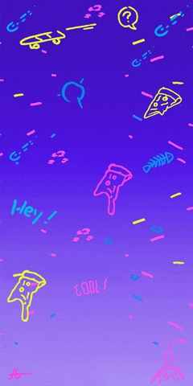
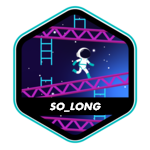

# Hi, I'm Alê!

### Who am I?

I'm a guy who has worked in the financial department of major Brazilian travel companies for 7 years and in 2020 decided to work with development. Also I'm a guy who love games and know how things works.

---

### What I do in my life?

Work at Delfia Tech as ServiceNow Technical Consultant!.

### What technologies can I work with today?

  

### What technologies am I currently studying? 

  

  

I also have a lot of experience with integrating microsoft Office through VBA and I am an expert in Excel

  

---

### My codes
<!--

I'm still building my portfolio, adding several simple projects, but that help to understand programming languages even more. You can find some of them <a href="https://oskadoskaposka.github.io/">HERE!</a> 

-->

I'm still building my portfolio, adding several simple projects, but that help to understand programming languages even more.</a> 

 

   
   
   

---

### My projects

<!-- 
I've always had great ideas and now I'm working on a scalable and very profitable idea.

I also have a project of an exclusive travel agency for the gamer audience that went wrong because of the coronavirus pandemic and that I would be very happy to explain to someone who takes it off the ground and makes it happen.
 -->

Actually I'm focused in pipex, a project to use pipes in bash!

42 Projects:

---

### Contact

To find me, just send a DM:

  

---
### Hints!

TWO SCREENS VSCODE - A solution is to press CTRL+K and after releasing CTRL, press O. This will open the current file in a new window.

Make a rule in makefile named git, to easely update commits

...

---

### See you later!!

  

<!--
**oskadoskaposka/oskadoskaposka** is a ✨ _special_ ✨ repository because its `README.md` (this file) appears on your GitHub profile.

Here are some ideas to get you started:

- 🔭 I’m currently working on ...
- 🌱 I’m currently learning ...
- 👯 I’m looking to collaborate on ...
- 🤔 I’m looking for help with ...
- 💬 Ask me about ...
- 📫 How to reach me: ...
- 😄 Pronouns: ...
- ⚡ Fun fact: ...

Para fazer uma lista para selecionar oq exibir

Lista

Itens

-->
