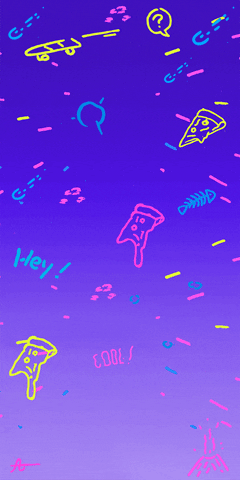
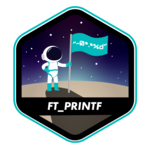
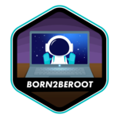
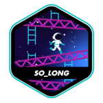

# Hi, I'm Alê! 👋

### Who am I?

I'm a developer who likes understanding **how things actually work**.

I spent about 7 years working in the financial side of large Brazilian travel companies until, in 2020, I decided to completely change careers and move into software development.

It turned out pretty well. 😅

Today I work mainly with **ServiceNow, JavaScript, integrations, APIs and automation**, while still building random things whenever an idea gets stuck in my head.

I like technology, games, hardware and figuring out how things work — sometimes even when I probably shouldn't be touching them.

 

---

## 👨‍💻 What I do for a living

Currently working at **Delfia Tech**, mainly with **ServiceNow development and enterprise integrations**.

Most of my day involves:

- ServiceNow development
- JavaScript
- Business Rules & Script Includes
- Flow Designer and automation
- REST APIs & integrations
- Service Portal
- Troubleshooting production problems
- CMDB / ITSM / CSM
- Performance investigations

Basically:

> I build things, integrate things, automate things and occasionally investigate why everything is on fire.

---

## 🧰 Stuff I actually use

  
  
  
  
  

  
  
  
  
  

  
  
  

---

## 📊 The unnecessarily cool GitHub graphs

Because numbers and colorful graphs make everything look more scientific.

  
  

---

## 🧪 Things I build / break

My GitHub is basically a timeline of things I wanted to understand, test or build.

### ☁️ ServiceNow

A big part of my professional life today revolves around the ServiceNow ecosystem.

There are training and experimental projects here on GitHub. Most of the really interesting enterprise code obviously stays where it belongs.

🔗 **[ServiceNow Developer Training](https://github.com/oskadoskaposka/ServiceNow-Developer-Training)**

### 🗃️ My code drawer

I also keep a repository with snippets, references and pieces of code that are useful mostly to **future me**.

It's not really a project.

It's more like:

> "I know I've solved this before. Where the hell did I put it?"

🔗 **[code-snippets](https://github.com/oskadoskaposka/code-snippets)**

🔗 **[See all my public repositories](https://github.com/oskadoskaposka?tab=repositories)**

---

## 🏛️ Ancient artifacts

Before ServiceNow, integrations and production incidents, there was **42**.

And a suspicious amount of C.

These repositories are old, but I'm keeping them because this is where a lot of the madness started.

### [Libft](https://github.com/oskadoskaposka/Libft)

### [Get Next Line](https://github.com/oskadoskaposka/gnl)

### [ft_printf](https://github.com/oskadoskaposka/ft_printf)

### Born2beroot

### [so_long](https://github.com/oskadoskaposka/so_long)

### Things survived

`malloc` • pointers • Makefiles • Linux • Bash • C • memory leaks • Norminette

Mostly.

---

## 🧠 Random stuff that saved me more time than it should

This section exists because I constantly forget useful things.

### VS Code — open current file in another window

Press:

`CTRL + K`

release CTRL, then:

`O`

### Makefiles

Having a small `git` rule in a Makefile can be surprisingly useful for repetitive project commits.

### Things I will probably add here later

Commands, weird fixes, shortcuts and random discoveries that were useful enough for me to think:

> "I should write this somewhere before I forget again."

And apparently, this is that somewhere.

---

## 📫 Contact

If you want to talk about development, ServiceNow, integrations, projects or weird technical problems:

- 💼 **LinkedIn:** [alexandre-paduan](https://www.linkedin.com/in/alexandre-paduan/)
- ✉️ **Email:** [alepaduanlima@gmail.com](mailto:alepaduanlima@gmail.com)
- 💬 **Discord:** [send me a DM](https://discord.gg/fwMgb27Rmh)

  
  
  

---

### See you later! 👋

  
